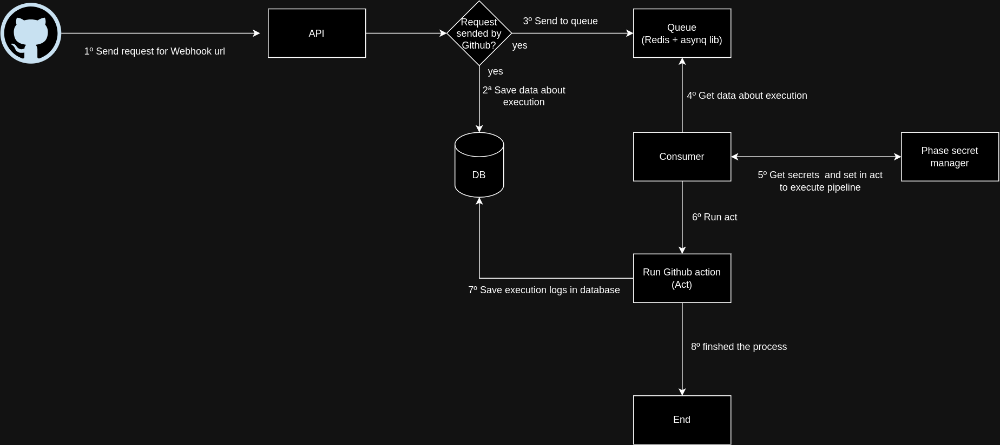

## About

The project is one api create your own Github actions to run your Github action pipelines.

## Requirements

- Golang(version 1.19)
- Docker and Docker compose
- Act installed. Tip: https://nektosact.com/installation/index.html to install act in your OS.
- Pm2 installed. Tip: can be helpfull tool to keep to golang api and job process running forever.

## Instructions

- Clone project
- Create file **.env** file based **.env.example** file.
- Execute command **bash scripts/setupLocally.sh** to setup to create directories: logs and pipelines and sqlite file named **database**
- Execute command **docker-compose up -d** to run redis container. I'm using redis as queue in that project.
- Execute command **go run cmd/api/main.go** to start api at address http://localhost:3000 .
- Execute command **go run cmd/job/main.go** to start job process when is reponsable to consume message from the queue and execute GithubAction pipeline.
- Execute command **bash scripts/deploy.sh** to build the project and execute using pm2.


## Architecture




## Explanation about envs

```
API_KEY="" // You set random value here, but many endpoint you will need to pass on header the requests. For example: curl --request GET \
  --url http://localhost:3000/triggers \
  --header 'Content-Type: application/json' \
  --header 'User-Agent: insomnia/9.3.3' \
  --header 'x-api-key: API_KEY_VALUE_HERE' \
  --data '{}'
API_BASE_URL="http://localhost:3000" // The address where your api is running
REDIS_URL="127.0.0.1:6379"  // The redis url connection

PHASE_TOKEN_SERVICE=""  // The phase token service will generate, to generate follow the instructions: https://docs.phase.dev/console/apps#service-tokens
PHASE_HOST="https://console.phase.dev" The phase secret manager api endpoint 
PHASE_PROJECT=""       // The project name
PHASE_ENV=Production  // The environment you will use to store the secrets
```